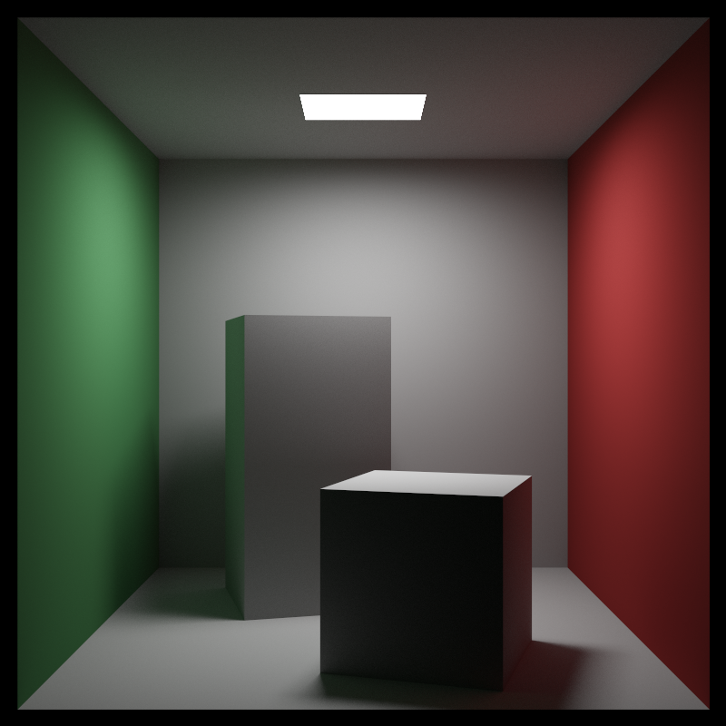
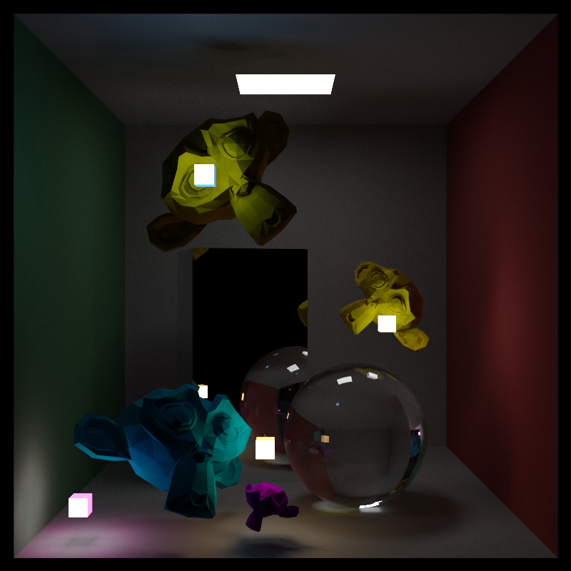

# This branch is for ReSTIR dev

Just simply use whatever buildtool you have(it's Cmake to me) to build and run.

under project folder:

```powershell
cmake . -Bbuild
cmake --build build
```

and you should find the executable in _./build_.

to run the code directly:

```powershell
RayTracing.exe
```

or with custom samplers amount (taking 512 for an example)

```powershell
RayTracing.exe 512
```

***BE AWARE!!*** Due to my poor coding technics, your PC is much likely to be **_FROZEN_** during the run. Sorry about that :(

Images:




