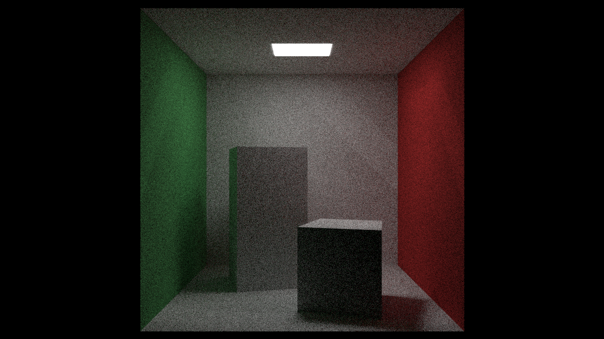
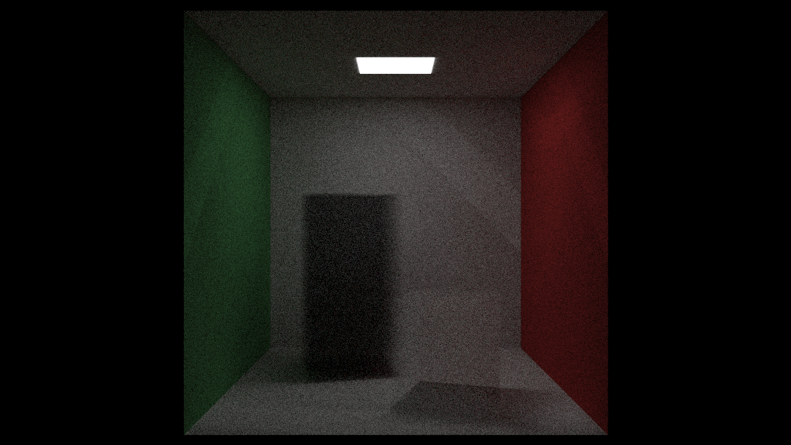

# RT in weeks

Just simply use whatever buildtool you have(it's Cmake to me) to build and run.

under project folder:

```powershell
cmake . -Bbuild
cmake --build build
```

and you should find the executable in *./build*.

***BE AWARE!!*** Due to my poor coding technics, your PC is much likely to be ***FROZEN*** during the run. Sorry about that :(

Here comes some images rendered from the little Ray Tracer :)




